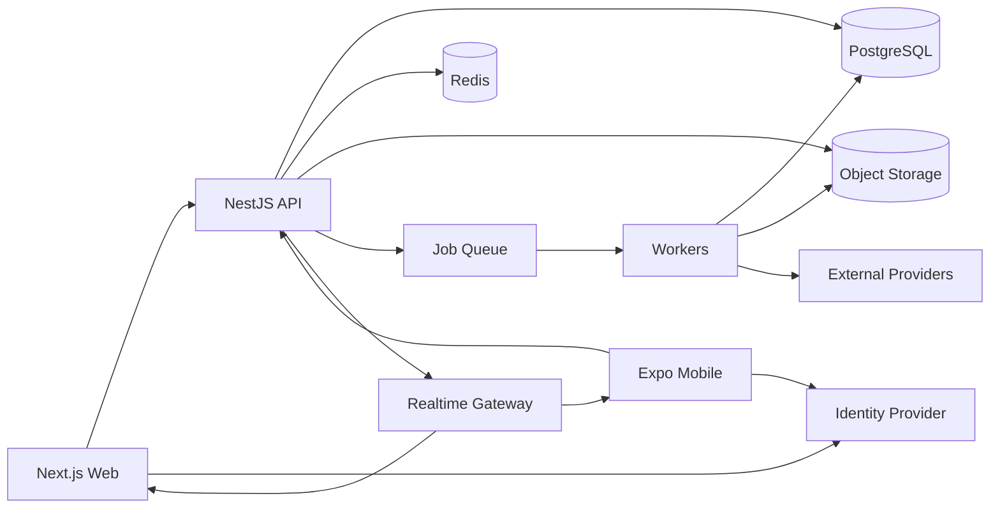

# EDUVERA — Technical Architecture

**Document:** 02_TECHNICAL_ARCHITECTURE.md  
**Target:** Production Web + Android + iOS  
**Architecture style:** TypeScript monorepo + modular monolith + background workers + realtime gateway  
**Status:** Recommended production architecture; the uploaded JSX is a UI prototype, not a production backend architecture.

---

## 1. Executive recommendation

Build EDUVERA as a **multi-tenant SaaS platform** with:

- **Next.js** for the public website and operations web application.
- **React Native + Expo** for Android and iOS.
- **Expo Router** for native application navigation.
- **NestJS** for the backend API.
- **PostgreSQL** as the primary system of record.
- **Redis** for caching, rate limits, distributed locks and job queues.
- **BullMQ** workers for asynchronous jobs.
- **WebSockets/SSE** for realtime updates.
- **S3-compatible object storage** for documents and attachments.
- **OpenAPI-generated TypeScript clients** shared by web and mobile.
- **OIDC/OAuth-based identity** with MFA/OTP options.
- **RBAC + ABAC + record-level scoping** for permissions.
- **A policy-controlled AI orchestration layer** that uses application tools rather than direct database access.
- **OpenTelemetry + centralized logs + error monitoring** for observability.
- **Infrastructure as code** and automated CI/CD.

Start as a modular monolith. Extract services only when scale, fault isolation or team topology gives a measurable reason.

---

## 2. Why not one universal UI codebase?

Expo can target mobile and web, but EDUVERA has two very different web needs:

1. Public website / SEO / marketing / admissions discovery.
2. Dense operations software for school staff.

The native mobile app also needs:

- push notifications,
- local/offline storage,
- device files/camera,
- biometrics,
- native navigation,
- background sync.

Therefore:

```text
Shared:
  domain types
  API client
  validation
  authorization primitives
  design tokens
  analytics events
  utility logic

Not forcibly shared:
  page/screen composition
  complex data tables
  desktop sidebar
  native gestures
  mobile navigation
```

This avoids the “lowest common denominator” problem.

---

## 3. Repository structure

Recommended monorepo:

```text
eduvera/
├─ apps/
│  ├─ web/                    # Next.js: public + staff/parent/student web
│  ├─ mobile/                 # Expo React Native: Android + iOS
│  ├─ api/                    # NestJS HTTP/realtime application
│  ├─ worker/                 # BullMQ background consumers
│  └─ docs/                   # architecture/product documentation
│
├─ packages/
│  ├─ domain/                 # domain types, enums, policies
│  ├─ api-client/             # generated typed API client
│  ├─ validation/             # shared schemas
│  ├─ design-tokens/          # web + native token source
│  ├─ authz/                  # permission helpers
│  ├─ observability/          # tracing/logging helpers
│  ├─ config/                 # lint/ts/build config
│  └─ test-fixtures/          # factories and fixtures
│
├─ infra/
│  ├─ terraform/
│  ├─ docker/
│  └─ environments/
│
└─ .github/
   └─ workflows/
```

Use a monorepo build system such as Turborepo or Nx.

---

## 4. Client applications

### 4.1 Web

#### Public routes

```text
/
 /about
 /academics
 /admissions
 /fees
 /news
 /contact
 /login
```

#### Authenticated web

```text
/app
/app/students
/app/admissions
/app/fees
/app/attendance
/app/timetable
/app/conversations
/app/academics
/app/staff
/app/reports
/app/settings
```

The exact authorized routes are resolved server-side.

Use server rendering/static generation where useful for the public website.  
Authenticated application data is fetched using secure application APIs.

---

### 4.2 Mobile

Use Expo React Native with file-based routing.

Illustrative route tree:

```text
src/app/
├─ _layout.tsx
├─ (auth)/
│  ├─ login.tsx
│  ├─ otp.tsx
│  └─ select-school.tsx
├─ (app)/
│  ├─ _layout.tsx
│  ├─ home.tsx
│  ├─ more.tsx
│  ├─ ai.tsx
│  └─ [capability]/
│     └─ ...
└─ modal/
   ├─ search.tsx
   ├─ notifications.tsx
   └─ approval.tsx
```

Navigation is assembled from the permission manifest after authentication.

---

## 5. Backend style: modular monolith

Do not begin with independent microservices.

Use one deployable backend with hard domain boundaries.

Recommended NestJS modules:

```text
IdentityModule
TenantModule
AuthorizationModule
SchoolConfigModule

AdmissionsModule
StudentModule
GuardianModule
StaffModule

FeeModule
PaymentModule
ReconciliationModule

AttendanceModule
LeaveModule
TimetableModule

AcademicModule
AssignmentModule
AssessmentModule

ConversationModule
AnnouncementModule
NotificationModule

DocumentModule
ReportModule
AuditModule
SearchModule

AIOrchestrationModule
IntegrationModule
```

Each module owns:

- controllers,
- commands/queries,
- domain services,
- persistence interfaces,
- events,
- authorization rules.

Avoid importing another module’s database repository directly.

---

## 6. High-level request architecture



---

## 7. Multi-tenancy model

Every production business record must belong to a tenant.

Core dimensions:

```text
tenant_id       # school organization
campus_id       # optional campus
academic_year_id
```

Example record:

```text
attendance_record
  id
  tenant_id
  campus_id
  academic_year_id
  student_id
  date
  status
  marked_by
  marked_at
```

### Recommended approach

Start with:

- one PostgreSQL cluster,
- shared schema,
- mandatory `tenant_id`,
- application authorization,
- database row-level security as defense in depth.

### Know the ceiling of that starting point

One shared cluster is correct up to roughly 1,000 tenants. It is not a permanent answer.

```text
~100 tenants     one primary, as written above
~1,000 tenants   + connection pooler, partitioning, read replicas
~3,000 tenants   single primary saturated by the morning attendance burst
10,000 tenants   requires cells (see the cell-based scale-out section)
```

Beyond that, the tenant population is split across cells — independent database clusters, each holding a subset of tenants. Because `tenant_id` is mandatory on every record, that split is a deployment and routing change rather than a domain redesign.

Design for it now by never writing a query, job or report that assumes all tenants are reachable in one database.

For very large individual tenants, dedicated database isolation is the same mechanism: a cell of one.

---

## 8. Institution model

EDUVERA is not a schools-only product. It targets any education provider, in any country.

```text
institution_type
  school            primary / secondary / K-12
  playschool        nursery, preschool, early years, daycare
  coaching_centre   test prep, tutoring, skills and vocational training
  college           higher education, degree-granting
```

These share one domain model. They do not share one feature set.

### Capability profile, not forked code

Institution type resolves a capability profile at tenant level:

```text
concept              school       playschool     coaching        college
academic year        yes          yes            rolling batches  semesters/terms
class grouping       grade+section age group     batch            programme+course
guardian linkage     required     required       optional         optional (adult)
attendance           daily/period session        per session      per lecture
assessment           exams+marks  observations   tests+mocks      credits+GPA
published result     report card  progress note  score report     transcript
timetable            yes          daily routine  batch schedule   course schedule
fee shape            term/annual  monthly        course/batch fee tuition+per-credit
```

Rules:

- The schema is shared. Institution type toggles capabilities and vocabulary; it must never fork the data model.
- Coaching centres have no academic year. Enrolment starts any week and a batch is the primary grouping. Anything that assumes a year boundary must degrade to a batch boundary.
- Playschools do not grade. Assessment is observational and narrative; forcing marks into that surface makes the product unusable for them.
- Colleges enrol adults. Guardian access must default to off wherever the learner is over the age of majority in the tenant's jurisdiction, and be grantable only by the learner.

### Vocabulary is data, not code

Do not hard-code `school`, `parent`, `grade` into schemas, API contracts or permission names.

```text
neutral in the model     rendered per institution + locale
institution              school / centre / college / preschool
class_group              class / grade / year group / batch / cohort / section
guardian                 parent / guardian / next of kin / sponsor
staff_member             teacher / tutor / faculty / educator
enrolment_period         academic year / term / semester / batch
```

The term shown to a user comes from a per-tenant terminology pack layered over the locale. Renaming is a configuration change, never a migration.

---

## 9. Authorization architecture

This is a critical system boundary.

Do not model authorization using only:

```text
role = principal | teacher | parent | student
```

Use:

```text
Role -> Permission -> Scope -> Record policy
```

Example:

```text
Permission:
  attendance.read
  attendance.mark
  attendance.correct
  attendance.approve_leave

Scope:
  school
  campus
  department
  grade
  section
  assigned_classes
  linked_children
  self
```

Examples:

### Principal

```text
students.read -> school
fees.read -> school
fees.approve_concession -> school
attendance.read -> school
timetable.manage -> school
```

### Class teacher

```text
students.read -> assigned_classes
attendance.mark -> assigned_classes
messages.send -> assigned_classes
```

### Parent

```text
student.read -> linked_children
attendance.read -> linked_children
fees.read -> linked_children
leave.request -> linked_children
```

### Student

```text
student.read -> self
attendance.read -> self
assignments.read -> self
assignments.submit -> self
```

---

## 10. Permission manifest

After login, clients obtain a permission-aware bootstrap response.

Example:

```json
{
  "identity": {
    "userId": "user_123",
    "tenantId": "school_1",
    "displayName": "Dr Kavitha Srinivasan"
  },
  "roles": ["principal"],
  "scopes": {
    "campusIds": ["campus_1"]
  },
  "capabilities": {
    "students": ["read", "write"],
    "fees": ["read", "write", "approve"],
    "attendance": ["read", "mark", "correct"],
    "reports": ["read", "export"],
    "ai": ["read", "propose_action"]
  },
  "navigation": [
    {"id": "home", "priority": 100},
    {"id": "students", "priority": 90},
    {"id": "attendance", "priority": 80},
    {"id": "fees", "priority": 70}
  ]
}
```

The server remains authoritative even if a modified client tries to call a hidden API.

---

## 11. Core data model

Primary entities:

### Tenancy

```text
Tenant
  institution_type      school | playschool | coaching_centre | college
  country
  jurisdiction
  data_region
  base_currency
  locale / timezone
  terminology_pack
Campus
EnrolmentPeriod         academic year | semester | term | rolling batch
Term
TaxProfile
InvoiceSeries
User
Role
Permission
UserRole
UserScope
```

Country, jurisdiction, data region, currency, timezone and institution type are tenant attributes resolved at bootstrap. No behaviour anywhere in the system may assume a single country, currency, calendar or institution shape.

### People

```text
Student
Guardian
StudentGuardian
Staff
StaffAssignment
Class
Section
Enrollment
House
```

### Admissions

```text
AdmissionApplication
Applicant
AdmissionStage
ApplicationDocument
Assessment
Interview
Offer
AdmissionNote
```

### Fees

```text
FeePlan
FeeHead
StudentFeePlan
Invoice
InvoiceLine
Concession
InstallmentPlan
Payment
PaymentAllocation
Refund
Receipt
ReconciliationEntry
```

### Attendance

```text
AttendanceSession
AttendanceRecord
LeaveRequest
AttendanceCorrection
```

### Timetable

```text
Subject
Room
Period
Timetable
TimetableSlot
TeacherAssignment
Substitution
Conflict
```

### Academics

```text
Assignment
Submission
AssessmentDefinition
AssessmentResult
GradeScale
CreditDefinition
ReportCard
LearningResource
```

`GradeScale` is per tenant and per programme, never global. The product must express at least:

```text
percentage            0-100, with jurisdictional pass marks
letter                A-F, with locale variants
GPA                   4.0, 5.0 and 10.0 point scales
credit-based          ECTS, US credit hours, weighted GPA
band/level            IB 1-7, A-level, national qualification bands
narrative             playschool observations, no numeric grade
competency            met / developing / not met
```

Results are stored as the raw achieved value plus the scale that produced them. Never store only a derived letter or GPA — the same mark maps differently under different scales, and transcripts must be reproducible years later.

Playschools produce narrative observations and must never be forced through a numeric scale.

### Messaging

```text
Conversation
ConversationParticipant
Message
Attachment
Announcement
ReadReceipt
```

### Platform

```text
Notification
Document
AuditEvent
BackgroundJob
Integration
WebhookDelivery
AIConversation
AIMessage
AIActionProposal
AIActionExecution
```

---

## 12. Database

Use PostgreSQL as the authoritative transactional store.

Reasons:

- relational integrity,
- transactions,
- reporting-friendly structure,
- JSONB for flexible metadata,
- row-level security support,
- mature indexing,
- full-text search options,
- vector extension available if later useful.

Important rules:

- use UUID/ULID-style opaque public identifiers,
- unique constraints include tenant context,
- foreign keys wherever practical,
- soft delete only where domain/audit requirements need it,
- immutable financial transactions,
- append-only audit events,
- monetary values stored using integer minor units or fixed decimal types.

### Connection pooling

Run PgBouncer (transaction pooling) in front of every PostgreSQL cluster from the first multi-replica deployment.

```text
30 API pods x 20 pooled connections = 600 connections
PostgreSQL degrades past ~300-500 active backends
```

This is the first hard scaling failure the system will hit, and it arrives around 100 tenants — long before storage becomes a concern.

Transaction pooling forbids session-level state. Session `SET`, advisory locks held across statements and server-side prepared statements outside a transaction must not be used.

### Partitioning

The following tables must be declaratively partitioned before they are allowed to grow:

```text
attendance_record       RANGE (date), monthly
audit_event             RANGE (timestamp), monthly
notification_delivery   RANGE (created_at), monthly
message                 RANGE (created_at), monthly
```

Partition-defining columns must appear in queries so the planner can prune. An attendance query without a date bound scans the year.

Partition creation and detachment are scheduled jobs, not manual operations.

### Growth expectations

Attendance dominates every other table by an order of magnitude. See the capacity model section, and decide early whether attendance is recorded daily or per period — the difference is 7x on the largest table in the system.

---

## 13. Row-level security

RLS should be defense in depth, not the only authorization system.

Policy boundary:

```text
tenant_id = current_tenant()
```

### Keep RLS to tenant isolation only

Do not express user-level scope — `linked_children`, `assigned_classes`, `self` — as RLS policies.

Those policies become correlated subqueries that the planner cannot inline. On a partitioned, billion-row attendance table the result is a sequential scan per query, and the failure appears only under production data volume.

```text
RLS          ->  tenant isolation. One indexed predicate. Defense in depth.
application  ->  permission, scope and record policy. Composed into the query.
```

`current_tenant()` must be declared `STABLE` so it is evaluated once per query and the planner can treat it as a constant against the `tenant_id` index.

However:

- application services still perform explicit policy checks,
- background jobs use controlled service identities,
- privileged DB roles are tightly limited,
- RLS tests are mandatory.

---

## 14. API design

Recommended external client API:

- REST/JSON
- OpenAPI contract
- typed generated clients

Examples:

```text
GET    /v1/bootstrap
GET    /v1/students
GET    /v1/students/:id
POST   /v1/attendance/sessions/:id/submit
POST   /v1/leave-requests
GET    /v1/invoices
POST   /v1/invoices/:id/payment-intent
POST   /v1/conversations/:id/messages
GET    /v1/timetable
POST   /v1/ai/messages
POST   /v1/ai/actions/:proposalId/confirm
```

Use cursor pagination for large lists.

All list APIs support:

- filtering,
- sorting,
- pagination,
- scoped search.

---

## 15. Realtime architecture

Realtime is useful for:

- messages,
- notification counters,
- payment completion,
- attendance submission state,
- timetable changes,
- AI job status,
- live admin dashboards.

Use:

- WebSocket gateway where bidirectional realtime is useful,
- SSE where one-way server events are enough,
- push notifications when the mobile app is inactive.

Do not use WebSockets for everything.

### Sizing

```text
~23M identities x 3% concurrent  =  ~700,000 concurrent sockets
one Node gateway instance        =  ~30,000-50,000 sockets
                                 =  ~20 gateway instances
```

At that fan-out, plain Redis pub/sub broadcast becomes the bottleneck: every instance receives every message and discards most of them.

Required:

- subscriptions are per tenant and per user, never global,
- a sharded broker or dedicated realtime transport rather than one Redis channel space,
- gateways hold no session state, so any instance can serve any reconnect,
- clients degrade to polling on connection failure rather than retry-storming,
- reconnect uses jittered backoff — 700k clients reconnecting together after a deploy is a self-inflicted outage.

Realtime is per cell. A gateway serves only the tenants in its own cell.

---

## 16. Background job architecture

Use Redis + BullMQ for:

- emails,
- push notifications,
- SMS/WhatsApp,
- report generation,
- receipt PDFs,
- data exports,
- payment reconciliation,
- reminder campaigns,
- scheduled reports,
- document processing,
- AI long-running tasks,
- search indexing,
- import jobs.

Pattern:

```text
API transaction
  -> writes business data
  -> writes outbox event
  -> worker publishes/executes side effect
  -> delivery status recorded
```

This avoids “invoice saved but message failed silently.”

### Fan-out jobs must be batched

A fee reminder campaign at full scale addresses millions of recipients. One queue job per recipient will exhaust Redis memory and starve every other queue.

```text
wrong:  1 job per parent          ->  ~10,000,000 Redis entries per campaign
right:  1 job per section/class   ->  ~250,000 jobs, each expanding to ~40 recipients
```

Rules:

- campaign jobs expand recipients inside the worker, from the database, not in the queue,
- campaigns are chunked and rate-limited to respect push, SMS and email provider quotas,
- campaign progress is checkpointed so a worker restart resumes rather than restarts,
- bulk campaigns run on a separate queue and worker pool from interactive jobs, so a reminder run cannot delay a payment receipt,
- every campaign is cancellable mid-flight.

Queues are per cell.

---

## 17. Messaging architecture

Messages should be durable domain records.

Do not rely on the push provider as the message store.

Flow:

```text
User sends message
  -> API validates participant/scope
  -> Message stored
  -> Outbox event created
  -> realtime event emitted
  -> push/email notification job queued
  -> recipient opens exact thread
```

Attachments live in object storage using signed URLs.

---

## 18. Notification architecture

One notification service, multiple delivery channels.

```text
Notification
  event_type
  recipient_user_id
  object_type
  object_id
  title
  body
  priority
  channels[]
  read_at
```

Channels:

- in_app
- push
- email
- sms
- whatsapp

Each tenant can configure policies.

### Consent and communication law

Messaging to families is regulated, and the rules differ per country. This is a compliance surface, not a delivery detail.

```text
ConsentRecord
  tenant_id
  subject_user_id
  channel
  purpose            transactional | reminder | marketing
  basis              consent | contract | legitimate_interest
  granted_at / withdrawn_at
  source
```

Rules:

- Transactional messages (fee due, absence, emergency) and promotional messages are separate purposes with separate consent. Never send the second under the basis of the first.
- Withdrawal of consent takes effect immediately across every channel and is auditable.
- Sender identity, registration and template pre-approval are mandatory in several markets. Templates are per-market objects, not one global string.
- Quiet hours are evaluated in the recipient's timezone, not the institution's, and not the server's.
- Channel availability varies by country. The channel set is resolved from tenant and recipient locale, with in-app and email as the universal fallback.

### Localization of content

Notification bodies are templates resolved against the recipient's locale, the tenant's terminology pack and the tenant's currency and date format. A notification must never be assembled by concatenating translated fragments — pluralization, gender agreement, word order and script direction differ per language.

---

## 19. Payment architecture

Never let the payment gateway become the financial ledger.

EDUVERA owns:

- invoice,
- line items,
- concessions,
- installments,
- payment allocation,
- receipt,
- refund state,
- reconciliation.

Payment gateway owns:

- collection transaction,
- gateway status,
- payment instrument metadata.

Use a provider abstraction:

```ts
interface PaymentProvider {
  createPaymentIntent(...)
  fetchPayment(...)
  refund(...)
  verifyWebhook(...)
}
```

### Multi-provider by country

No single processor covers every market, and the market a tenant sells in is not a deployment decision — it is tenant data.

```text
tenant
  country
  base_currency
  payment_provider_binding[]   provider, method set, merchant account, settlement account
```

Provider selection is resolved per tenant, per payment method, at request time. Adding a market must be a configuration and integration task, never a change to fee, invoice or reconciliation logic.

Local payment methods matter more than card coverage in most markets:

```text
cards + wallets    near universal
bank debit         SEPA Direct Debit, ACH, BACS, PAD, NACH
bank transfer      SEPA Credit Transfer, Faster Payments, Wire
real-time rails    UPI, PIX, iDEAL, Blik, PromptPay, FPS
cash/voucher       Boleto, OXXO, konbini, bank challan
```

Recurring tuition collection depends on the mandate model of the local rail, not on card storage. Design the mandate as a first-class object:

```text
PaymentMandate
  tenant_id
  payer
  provider
  rail                  card_on_file | sepa_dd | ach | nach | upi_autopay | ...
  mandate_reference
  authorized_amount_cap
  valid_from / valid_to
  status
  revoked_at
```

### Regulatory obligations on the payment path

- Strong Customer Authentication and 3-D Secure are mandatory in the EEA, UK and India for many flows. The payment intent must be able to return a challenge, and the UI must handle it — a design assuming one-shot charge success will fail in those markets.
- Direct debit rails carry statutory pre-notification periods and dispute windows measured in weeks to months. Reconciliation must tolerate a payment being reversed long after a receipt was issued.
- Refund and cooling-off rights differ by jurisdiction. Refund eligibility is a policy resolved from tenant jurisdiction, not a fixed rule.
- Surcharging cards is prohibited in some jurisdictions and permitted in others. Fee-bearing must be configurable per tenant.

### Settlement

```text
charge currency     currency the payer is charged in
invoice currency    currency the invoice is denominated in
settlement currency currency the tenant is paid out in
```

These are three different things and must be stored separately. Never infer one from another. Provider fees and FX spread are recorded against the payment, never silently deducted from the invoice balance.

Webhook handling must be:

- signature verified,
- idempotent,
- persisted,
- replayable,
- reconciled.

Webhook processing must be tolerant of out-of-order and duplicate delivery, and of a terminal state arriving before the intermediate one.

---

## 20. Money and multi-currency

Money is never a bare number anywhere in this system.

```text
Money
  amount_minor   integer
  currency       ISO 4217 code
```

### The exponent is not always 2

```text
JPY, KRW, VND, CLP, ISK      0 decimals   -> minor unit == major unit
most currencies              2 decimals
KWD, BHD, OMR, JOD, TND      3 decimals
```

Never multiply by 100 to get minor units. Resolve the exponent from the currency. A hard-coded 100 silently overcharges by 10x in Kuwait and undercharges by 100x in Japan.

### Currency scoping

```text
tenant.base_currency        reporting and accounting currency of the institution
invoice.currency            fixed at issue, never re-denominated
payment.charge_currency     what the payer was actually charged
platform.billing_currency   what Eduvera bills the tenant in (SaaS subscription)
```

An issued invoice is never revalued because an exchange rate moved. Historical financial records are immutable in their original currency.

### Foreign exchange

Where conversion is unavoidable — cross-border tuition, consolidated group reporting — store the conversion, never just the result:

```text
FxConversion
  from_currency / to_currency
  rate
  rate_source
  rate_timestamp
  converted_at
```

Rules:

- Mixed-currency totals are never summed without an explicit stated conversion basis.
- Group or operator dashboards spanning currencies must label the rate and date used.
- A converted figure is a presentation artifact. It is never written back as the invoice amount.

### Rounding

Rounding is a jurisdictional rule, not a preference: whether tax rounds per line or per invoice, and to what precision, differs by country. Make it part of the tax profile and record the rounding applied on the invoice so a total can always be reproduced exactly.

Cash-rounding at the smallest circulating denomination (for example in Sweden, Switzerland and Canada) applies to the payable amount, not the invoice total.

---

## 21. Tax and invoice compliance

This is the area where a global education product most often has to be rebuilt. Design for it before the first market.

### Eduvera is not a tax engine

The product must compute, store and present tax correctly under a supplied rule set, and must integrate a tax determination service or the tenant's finance system where a market requires it. It should not attempt to encode the world's tax law itself.

### Tax profile per tenant

```text
TaxProfile
  jurisdiction
  regime              vat | gst | sales_tax | consumption_tax | none
  registration_number
  pricing_mode        tax_inclusive | tax_exclusive
  education_exemption exempt | zero_rated | reduced | standard
  rounding_rule
  place_of_supply_rule
```

Education is frequently exempt or zero-rated — but exemption commonly covers tuition while ancillary supplies (transport, uniforms, meals, trips, commercial short courses) remain taxable. The engine must support per-fee-head tax treatment, not one rate per invoice.

Tax-inclusive display is legally required for consumer pricing in some markets and unusual in others. Both must be supported at the line level.

### Invoice numbering

```text
InvoiceSeries
  tenant_id
  scope             tenant | campus | jurisdiction | document_type
  prefix / format
  next_number
  gapless           boolean
  reset_policy      never | annual | fiscal_year
```

Rules:

- Several jurisdictions require sequential, gapless numbering per series. A number is allocated at issue, not at draft creation, and is never reused.
- Numbers are allocated under a transactional guarantee. A cancelled invoice keeps its number and is recorded as cancelled.
- Credit notes use their own series.

### Issued documents are immutable

```text
draft      editable, no legal number
issued     immutable, numbered, delivered
adjusted   corrected only by a credit note or a new invoice
cancelled  retained, never deleted
```

An issued invoice is never edited, never re-priced and never deleted. Every correction produces a linked credit note that references the original document. This is both a legal requirement in most jurisdictions and the only way reconciliation can be trusted.

### Electronic invoicing and fiscal reporting

Multiple jurisdictions mandate clearance or reporting of invoices through a government or network channel, with formats and timing that differ per country. Treat this as a pluggable per-jurisdiction adapter behind a stable internal invoice model:

```text
FiscalSubmission
  invoice_id
  channel
  payload_format
  submitted_at
  authority_reference
  status
  response_document
```

The internal invoice must carry every field any adapter needs, so entering a new market is an adapter, not a schema migration.

### Retention

Financial records carry statutory retention periods that commonly exceed the archival policy used for academic data, and that vary by country. Retention is resolved from tenant jurisdiction and always wins over the general data lifecycle policy.

---

## 22. Document architecture

Documents include:

- admission documents,
- medical/leave notes,
- receipts,
- report cards,
- certificates,
- assignments,
- message attachments.

Store metadata in PostgreSQL and bytes in object storage.

Never expose raw bucket paths.

Use:

- signed upload URLs,
- signed download URLs,
- MIME/type validation,
- antivirus/malware scan,
- size limits,
- tenant prefixes,
- retention policies.

---

## 23. Search

Phase 1:

- PostgreSQL indexed search/full-text search for structured objects.

Phase 2 if scale/search relevance requires:

- dedicated search engine such as OpenSearch/Elasticsearch.

Search index entries must contain authorization dimensions so results can be filtered by scope.

Search is always tenant-scoped, so index size per query stays small — a tenant searches its own ~1,000 students, never 10 million. This makes PostgreSQL full-text search viable far longer than raw record counts suggest.

Each cell owns its own index. There is no global cross-tenant search in the product surface.

---

## 24. Mobile offline strategy

Offline matters most for:

- timetable,
- announcements,
- messages already loaded,
- teacher attendance.

Recommended local storage:

- encrypted secure credential storage,
- SQLite-based local cache for structured offline data.

Attendance offline flow:

```text
Teacher opens class
  -> roster cached
  -> marks attendance offline
  -> local pending operation stored
  -> connection returns
  -> sync API submits with idempotency key
  -> server validates current session/version
  -> client resolves any conflict
```

Do not enable offline mutation for financial approvals in the first release.

---

## 25. Authentication

Use standards-based identity.

Requirements:

- email/password where needed,
- phone OTP,
- MFA for privileged staff,
- session/device management,
- password reset,
- account lock/rate limiting,
- optional SSO for enterprise schools,
- biometric unlock on mobile after initial authentication.

Guardian/student account linking is a domain workflow and must not be inferred only from matching phone numbers.

---

## 26. AI architecture

The prototype correctly models AI as scoped to the user’s records and requiring confirmation for changes.

Production should implement this using a tool-based architecture.

### 23.1 AI request flow

```text
User prompt
  -> AI API
  -> authenticated user context
  -> AI policy engine
  -> approved read tools
  -> domain APIs
  -> structured evidence
  -> LLM response
  -> citations
```

The LLM does **not** receive unrestricted database credentials.

---

### 23.2 AI tool registry

Examples:

```text
student.search
student.get
attendance.summary
fees.invoice.get
fees.overdue.list
timetable.conflicts
conversation.thread.get
admissions.pipeline.query
announcement.draft
```

Write tools:

```text
leave.approve
message.send
feeReminder.queue
timetable.slot.move
student.flag
announcement.publish
```

Write tools cannot execute directly from free-form model output.

---

## 27. AI action proposal architecture

Recommended state machine:

```text
DRAFT
  -> PROPOSED
  -> USER_CONFIRMED
  -> EXECUTING
  -> SUCCEEDED
       or
     FAILED
       or
     EXPIRED
```

Proposal stores:

```text
proposal_id
tenant_id
user_id
tool_name
validated_arguments
human_summary
affected_objects
permission_snapshot
created_at
expires_at
```

On confirmation:

1. re-check user permission,
2. re-check record state,
3. validate arguments,
4. use idempotency key,
5. execute domain command,
6. write audit event,
7. return result.

### Human oversight is a regulatory property, not a UX preference

This state machine is what keeps the product on the right side of rules restricting solely-automated decisions about people. Preserve it exactly:

- There is no auto-execute path for any action affecting a person's admission, assessment, finances, discipline or access.
- The confirming user sees what will change, on what evidence, and can decline. A proposal that cannot be meaningfully evaluated is not oversight.
- The proposal record retains the model, provider and version alongside the permission snapshot, so a decision can be reconstructed long afterwards.
- Consequential proposals are attributable to the human who confirmed them, and that attribution is what the audit log records.

A person affected by a resulting decision must be able to request human review and contest the outcome. Build that as a workflow, not a support process.

---

## 28. AI citations

A citation should be a structured reference, not generated text.

Example:

```json
{
  "type": "invoice",
  "id": "inv_123",
  "label": "Term 2 invoice · Aarav Sharma",
  "deepLink": "/fees/invoices/inv_123"
}
```

The client renders it as a tappable citation.

---

## 29. AI privacy rule

Prefer querying canonical structured data through tools over copying the entire school database into embeddings.

Use vector search only where semantically useful, for example:

- policy documents,
- school notices,
- message history,
- knowledge resources.

Every vector/document record must retain:

- tenant,
- ACL/scope,
- source object,
- retention metadata.

### Categories the AI must never see

Restricted records — safeguarding concerns, medical and care information, special educational needs assessments, counselling notes, custody and contact orders, hardship eligibility — are excluded from AI context, retrieval and embeddings unless the requesting user holds the specific scope for that category.

Filtering must happen at retrieval, from the same permission model the API uses, never by prompt instruction. A cross-module assistant that inherits a broad staff scope is the most likely route to a serious disclosure incident in this product.

### Tenant data and model providers

- Tenant data must not be used to train third-party models. Establish this contractually with every provider and verify it; a settings toggle is not evidence.
- The processing location of a model endpoint is subject to the tenant's residency constraints like any other processor.
- Provider, model and version are recorded per request.
- Adding or changing a model provider is a sub-processor change and normally requires notice to tenants.

---

## 30. AI provider abstraction

Do not bind domain code directly to one model vendor.

Create:

```ts
interface AIProvider {
  generate(...)
  stream(...)
  embed(...)
}
```

The orchestration layer owns:

- prompt templates,
- policy,
- tools,
- citations,
- structured output validation,
- retries,
- model selection.

---

## 31. Reporting

Reports can be:

### Interactive

Generated from live queries, served from a read replica — never the primary. Interactive reports must be bounded by tenant and date range, and must read pre-aggregated summary tables rather than raw attendance or transaction rows.

### Scheduled

Generated by workers, against a read replica or the analytical store.

### Cross-tenant and operator reporting

Any report spanning tenants — SaaS operator dashboards, benchmarking, platform analytics — is served from the analytical store. It must never fan out queries across cells.

### Export

CSV/XLSX/PDF.

Every export request records:

- requester,
- scope,
- filters,
- time,
- generated file,
- expiry.

Large exports must run asynchronously.

---

## 32. Audit log

Audit is mandatory for:

- student record changes,
- fee changes,
- concessions,
- refunds,
- attendance corrections,
- leave approvals,
- role/permission changes,
- timetable changes,
- report-card publication,
- AI-executed actions.

Audit event:

```text
id
tenant_id
actor_user_id
actor_type
action
object_type
object_id
before
after
request_id
ip/device metadata
source = web | mobile | api | ai
timestamp
```

Financial/audit records should be append-oriented.

### Where audit data lives

Audit is written on nearly every mutation and quickly becomes the second-largest dataset in the system, behind attendance.

```text
write path    outbox event from the transactional database
retention     recent window kept in PostgreSQL, partitioned monthly, for record-level lookups
archive       streamed to a columnar analytical store for investigation and long-term retention
```

Do not let unbounded audit history accumulate in the transactional database — it competes for exactly the buffer cache and I/O that the morning attendance burst needs.

Audit reads are investigative and infrequent. Optimize the write path, not the read path.

---

## 33. Security controls

Baseline:

- TLS everywhere,
- encryption at rest,
- KMS-managed encryption keys,
- secret manager,
- MFA for privileged users,
- short-lived access tokens,
- refresh token rotation,
- rate limiting,
- CSRF protection where applicable,
- secure cookies on web,
- device-secure token storage on mobile,
- signed object URLs,
- upload validation,
- least-privilege cloud IAM,
- regular dependency scanning,
- SAST/DAST,
- backup encryption,
- restore testing.

Additionally required for a regulated, multi-market product:

- breach detection, triage and a notification workflow able to meet the shortest applicable statutory deadline,
- independent penetration testing on a defined cadence, with findings tracked to closure,
- a published vulnerability disclosure policy,
- redaction of personal and payment data from logs, error reports, session replay and support tooling at source,
- environment separation such that production personal data never reaches development or test systems,
- access reviews for privileged and support accounts, with break-glass access time-boxed, justified and alerted,
- a maintained sub-processor inventory tied to the tenant notice process.

---

## 34. Data protection, residency and consent

EDUVERA handles personal and academic data about children and adults, across jurisdictions with materially different and sometimes conflicting rules.

Design for:

- explicit purpose limitation,
- guardian linkage where the learner is a minor,
- data minimization,
- lawful basis and recorded consent,
- retention policies,
- export, portability and correction workflows,
- deletion and anonymization where legally permitted,
- strict access control,
- auditability.

### The age of majority is a variable

This is not a legal footnote — it changes the permission model.

```text
minor learner    guardian holds access and consent rights
adult learner    the learner holds them; guardian access requires the learner's grant
```

The threshold, and the age at which a learner may consent for themselves, differ per jurisdiction. Both must be tenant-jurisdiction attributes, evaluated at request time, never constants.

Consequences the product must handle:

- A college student turning 18 mid-year causes guardian access to lapse automatically, with notice to both parties.
- Some jurisdictions grant the paying guardian continued visibility of financial records while removing academic visibility. Financial scope and academic scope must therefore be separable.
- Where a guardian pays for an adult learner, the invoice payer and the record subject are different people with different rights.

### Data residency

Several jurisdictions restrict where personal data — particularly children's data — may be stored and processed.

```text
tenant.data_region   eu | uk | us | in | apac | ...
```

Residency is a tenant attribute that determines cell placement. A tenant's records, backups, search indexes, analytical extracts, document storage and log data all remain within its region. Cross-region movement happens only under an explicit, audited transfer mechanism.

The global control plane must therefore hold no personal data beyond what routing and authentication strictly require, since it is by definition cross-region.

### Subject rights

Access, correction, export, deletion, objection and portability requests arrive with statutory deadlines that vary by jurisdiction. Build them as a first-class operator workflow with tracked clocks, not as ad-hoc database work.

Deletion interacts with statutory financial retention: academic records may be erasable while the invoices referencing them must be retained. Deletion is therefore per-purpose, not per-person.

### Compliance review

Perform a formal legal review per market before launch, and treat each new country as a launch gate covering data protection, children's data, consumer and refund rights, tax and invoicing, communication law and payment regulation.

---

## 35. AI regulation and automated decisions

This is the highest-risk regulatory area in the product, and the one most likely to be underestimated.

> Nothing in this document is legal advice. Every point below is an engineering requirement that must be confirmed with qualified counsel per market, and re-confirmed as regimes change.

### Education AI is classified as high-risk in the EU

The EU AI Act designates AI systems used in education and vocational training as high-risk where they are used for:

```text
admission or assignment of learners to institutions or programmes
evaluating learning outcomes
assessing the appropriate level of education a person will receive
monitoring or detecting prohibited behaviour during assessments
```

EDUVERA's admissions scoring, assessment support and proctoring-adjacent features fall inside that list. Obligations that follow include a risk management system, data governance, technical documentation, automatic event logging, transparency to deployers, human oversight design, accuracy and robustness targets, a quality management system, conformity assessment before placing on the market, and post-market monitoring. Obligations phase in through 2026–2027.

Consequences for this architecture:

- Treat "does this feature perform, or materially assist, an admissions or assessment decision?" as a design gate, not a compliance review at the end.
- Every AI-assisted decision path must be separable and disableable per tenant and per region. A tenant in a market where the feature cannot be offered compliantly must be able to run the product without it.
- The AI event log is a regulatory artifact, not a debugging convenience. Retain inputs, tool calls, outputs, the model and version, the human decision that followed, and who made it.

### Prohibited practices

Some capabilities common in education technology are banned outright in the EU, not merely regulated:

```text
emotion inference in education institutions and workplaces   prohibited
social scoring of individuals                                prohibited
untargeted scraping to build facial recognition databases    prohibited
```

Do not build engagement, attention or emotion detection into classroom or proctoring features. This is a product decision that must be made once, centrally, and enforced — not left to a market team.

### Automated decisions about people

Independently of AI-specific law, data protection regimes restrict decisions producing legal or similarly significant effects made solely by automated processing. An admission rejection, a fee concession refusal, or an automated academic penalty are candidates.

Rules:

- No consequential decision is executed solely automatically. The existing AI action proposal state machine already requires human confirmation — keep that property and never add an auto-execute path for consequential actions.
- The confirming human must have the information and authority to disagree. A confirmation button that shows only a recommendation is not meaningful oversight.
- The affected person must be able to obtain an explanation, request human review, and contest the outcome. Build this as a product workflow.
- Record which human decided, on what basis, and what the system recommended.

### Transparency

- Users must be told when they are interacting with an AI system, and AI-generated content must be identifiable as such.
- AI output presented to guardians or learners carries a visible marker and its citations.
- Deployers — the institutions — need documentation sufficient to meet their own obligations, including intended purpose, limitations, known failure modes and required human oversight.

### Model providers and tenant data

- Tenant data must not be used to train third-party models. This must be contractual with every model provider and verified, not assumed from a settings toggle.
- Model provider processing locations are a residency question. A model endpoint outside a tenant's permitted region is a cross-border transfer.
- Provider, model and version are recorded per request, because reproducing what the system said months later is a regulatory expectation.
- Sub-processor changes require notice to tenants under most data processing agreements.

---

## 36. Accessibility obligations

Accessibility is a legal requirement in the product's principal markets, not a quality goal.

```text
EU        European Accessibility Act; EN 301 549 as the harmonized standard
US        ADA and Section 504 for institutions; Section 508 where federally funded;
          DOJ rulemaking sets WCAG 2.1 AA for public entities on a phased deadline
UK        Equality Act; public sector accessibility regulations
Canada    Accessible Canada Act; provincial regimes such as AODA
Australia Disability Discrimination Act
```

Engineering position:

- Target WCAG 2.2 AA across web *and* native mobile. Mobile is frequently forgotten and is the primary surface for guardians.
- Public-sector and state-funded institutions procure against accessibility conformance. An accessibility conformance report is a sales prerequisite in these markets, not an afterthought.
- Documents the product generates — invoices, report cards, transcripts, receipts — must be accessible as well. A tagged, readable PDF is part of the requirement.
- Accessibility regressions must fail CI. Automated checks catch a minority of issues; keyboard and screen-reader test passes belong in the release checklist.

---

## 37. Payment, financial and tax compliance

### Card data: stay out of scope

The product must never transmit, process or store primary account numbers. Use provider-hosted fields, redirects or SDKs so that the cardholder data environment stays with the provider.

```text
target        the simplest applicable PCI DSS validation tier
consequence   no card data in logs, analytics, support tooling, AI context,
              screenshots, session replay or database
```

Session replay and error reporting are the usual leak paths. Redact at source.

### Who is the merchant of record

This is a business-model decision with licensing consequences, and it must be made before the payment integration is designed.

```text
institution is merchant of record   funds settle directly to the institution;
                                    Eduvera orchestrates but never takes custody
Eduvera collects and remits         Eduvera handles third-party funds, which can
                                    require payment institution, money transmitter
                                    or payment aggregator authorization per market,
                                    plus AML/KYC obligations
```

Default to the first. Taking custody of tuition payments across many countries is a licensed activity in most of them, with capital, safeguarding-of-funds, onboarding-diligence and reporting requirements that dwarf the engineering effort of the payment feature itself.

### Regulated payment behaviour

- Strong customer authentication is mandatory for many flows in the EEA, the UK and India.
- Recurring collection rules differ per market — mandate formats, pre-debit notification periods, value caps and re-authentication requirements are all local.
- Some jurisdictions mandate that payment data be stored domestically. Payment residency can be stricter than general data residency and may force a separate regional deployment even where privacy law would not.
- Direct debit reversal windows extend for weeks or months. Financial state must never assume finality at receipt.
- Surcharging rules differ: prohibited in some markets, capped at cost of acceptance in others.

### Consumer contract rights

Coaching centres, short courses and online programmes sold to consumers attract consumer protection law that schools historically avoided.

- Distance selling regimes grant statutory withdrawal periods. Refund policy must be able to encode a cooling-off window per jurisdiction and per product type.
- Pre-contract disclosure, total-price display and clear cancellation terms are regulated.
- Automatic renewal of subscriptions is separately regulated in several markets.

### Tax and e-invoicing

- Place of supply, registration thresholds and education exemptions are per-jurisdiction, and exemptions rarely cover ancillary supplies.
- Cross-border digital or online course delivery can create registration obligations in the learner's country.
- Mandatory e-invoicing and real-time fiscal reporting regimes are expanding across the EU, Latin America, the Gulf, India and parts of Asia, each with its own format, channel and timing. Treat every one as an adapter behind the internal invoice model.
- Financial record retention periods are statutory, commonly five to ten years, and override the general data lifecycle.

### Electronic signature

Admission agreements, consent forms and fee undertakings must be signable electronically with an audit trail, under the recognized e-signature framework of the relevant market.

---

## 38. Communications and consent compliance

Messaging families is regulated separately from data protection, and the penalties are real.

```text
US        prior express consent for automated calls and texts; honour opt-out
          immediately; commercial email disclosure and unsubscribe requirements
Canada    express opt-in for commercial electronic messages, strictly enforced
EU/UK     ePrivacy rules for electronic marketing and for cookies and similar
          technologies; consent must be freely given, specific and revocable
India     registration of sender headers and message templates on the
          telecom regulator's platform before transactional sending
Global    business messaging platforms impose their own template approval,
          opt-in and session-window policies on top of local law
```

Engineering requirements:

- Transactional and promotional purposes are separate consents with separate audit trails. Fee reminders and attendance alerts are transactional; newsletters and enrolment marketing are not.
- Opt-out is honoured across every channel immediately, and the suppression list is authoritative over any campaign.
- Cookie and tracking consent gates analytics and any non-essential storage on web. Non-essential tags must not load before consent, and consent state is auditable.
- Do not profile or target minors for advertising. Several regimes prohibit it outright.
- Template registration and sender identity are per-market configuration objects.

---

## 39. Safeguarding and restricted records

Education products hold categories of information that must not be visible to all staff, and several jurisdictions impose statutory duties around them.

```text
safeguarding and child protection concerns
medical conditions, allergies, medication, care plans
special educational needs and disability assessments
counselling and wellbeing notes
behavioural and disciplinary records
legal orders affecting contact, custody or collection
immigration and residency status
free-meal or financial-hardship eligibility
```

Rules:

- These are restricted categories with their own permission scopes, not ordinary student fields. A class teacher's read access to a student record must not imply access to a safeguarding note.
- Access to restricted records is logged with reason capture, and the access log is reviewable by the institution's designated lead.
- Restricted records must be excluded from AI context, search results, exports, bulk reports and analytics unless the requesting user holds the specific scope. This is the single most likely path to a serious incident in a product with a cross-module AI assistant.
- Custody and contact orders constrain who may receive information and who may collect a child. The guardian linkage model must express restriction, not only association.
- Retention and transfer rules for safeguarding records are set by national policy and often differ from every other record type, including on transfer to another institution.
- Mandatory reporting duties exist in many jurisdictions. The product records and evidences a concern; it does not adjudicate one.

### Biometrics

Facial recognition and fingerprint attendance are common requests in this market and are heavily restricted. Biometric identifiers are a special category under most data protection regimes, some jurisdictions require written consent before collection and grant individuals a direct right of action, and processing children's biometrics attracts additional scrutiny.

Treat biometric attendance as an opt-in, per-market, separately consented capability with a non-biometric alternative always available — or do not build it.

---

## 40. Compliance operating model

### Shared responsibility

```text
institution (tenant)   controller - decides purposes, holds the relationship
                       with families, responds to most subject requests
Eduvera                processor - acts on documented instructions, secures
                       the data, assists the controller, manages sub-processors
Eduvera as controller   only for its own account, billing and product telemetry
```

This division must be reflected in the product, not only in contracts. Tenants need self-service tooling to discharge their own obligations.

### What must exist as software, not policy

- Processing records exportable per tenant.
- A subject request workflow with statutory clocks, covering access, correction, deletion, portability, objection and restriction — including the case where a record must be retained for financial or statutory reasons while other data about the same person is erased.
- A consent ledger covering purpose, basis, grant, withdrawal and source.
- Per-tenant data export in a documented format, on demand and at contract termination.
- Configurable retention and deletion schedules per record class and jurisdiction.
- An access log the institution can review itself.
- Breach detection and a notification workflow able to meet the shortest applicable deadline, with per-jurisdiction notification rules and tenant contact routing.
- A published, versioned sub-processor list with change notice.

### Certifications and assurance

Procurement in this sector gates on evidence, and the absence of it blocks deals irrespective of product quality.

```text
baseline        SOC 2 Type II, ISO/IEC 27001
privacy         ISO/IEC 27701, ISO/IEC 27018
sector/region   national education data protection frameworks, public-sector
                cloud assurance schemes, and country-specific ed-tech pledges
supporting      penetration testing, vulnerability disclosure, secure SDLC
```

Plan these as roadmap items with owners. They take quarters, not sprints.

### Interoperability as a procurement requirement

Institutional buyers increasingly require standards support in tenders:

```text
rostering and enrolment    OneRoster, Ed-Fi, SIF
learning tools             LTI 1.3 and Advantage
learning analytics         Caliper, xAPI
invoicing networks         Peppol and national equivalents
```

Support these behind the same module boundaries used elsewhere. They are integrations, never schema changes.

### Market launch gate

No market goes live until each item has a named owner and a documented answer:

```text
data protection regime and lawful basis
children's data rules and age thresholds
data and payment residency requirements
accessibility conformance
AI regulation classification for enabled features
tax registration, invoicing and e-invoicing mandates
consumer and refund rights
communications and consent law
safeguarding and record retention duties
payment licensing and merchant-of-record position
local contract, DPA and notice templates
```

Entering a country is a cross-functional gate, not a configuration change.

---

## 41. Deployment

Topology per region:

```text
CDN / WAF  (global edge)
    |
Next.js web
    |
API load balancer  (routes to the tenant's region)
    |
NestJS application replicas
    |
    +---- PgBouncer
    +---- PostgreSQL managed database (primary + replicas)
    +---- Redis managed service
    +---- Object storage
    +---- Worker replicas
    +---- Realtime gateway
```

### Regions

Deployment is multi-region from the outset, because data residency is a tenant attribute rather than an operational preference.

```text
global      CDN, WAF, DNS, tenant directory, identity, billing
per region  the full stack above, one or more cells
```

Rules:

- A tenant's data plane — database, cache, search, object storage, backups, logs and analytical extracts — stays within its permitted region.
- The global control plane holds no personal data beyond what routing and authentication require.
- Choose the cloud region nearest the tenant population that also satisfies its residency obligation; residency constrains the choice first, latency second.
- Provisioning a new region must be automated. Entering a market can require a region before that market has meaningful volume.
- Backups and disaster recovery are per region and never replicate across a residency boundary.

---

## 42. Environments

Maintain isolated:

- local
- development
- staging
- production

Optionally:

- preview environment per pull request for web
- internal QA mobile builds

Never use production student data in development.

---

## 43. Observability

Use OpenTelemetry-compatible tracing.

Capture:

- request ID,
- tenant ID,
- user ID (privacy-safe identifiers),
- module,
- route,
- latency,
- database timing,
- queue time,
- external provider latency,
- error class.

Recommended dashboards:

- API latency/error rate
- DB health
- queue depth
- notification delivery
- payment webhook/reconciliation health
- realtime connections
- AI latency/cost/tool failures

---

## 44. Product analytics

Track product behavior separately from operational audit.

Example analytics events:

```text
dashboard_opened
attendance_session_started
attendance_submitted
invoice_opened
payment_started
payment_completed
message_sent
ai_question_asked
ai_action_proposed
ai_action_confirmed
```

Never send sensitive educational/financial payloads to analytics tools unnecessarily.

---

## 45. CI/CD

Pipeline:

```text
PR
 -> lint
 -> typecheck
 -> unit tests
 -> security checks
 -> build
 -> integration tests
 -> preview/staging
 -> e2e tests
 -> approval
 -> production deploy
 -> smoke tests
```

Mobile:

- EAS/native build pipeline,
- internal distribution,
- staged store rollout,
- over-the-air updates only for changes allowed by platform policy.

---

## 46. Testing strategy

### Unit

- domain rules
- calculations
- authorization
- timetable constraints

### Integration

- repository/database
- payment webhooks
- notification outbox
- job handlers

### Contract

- OpenAPI compatibility
- provider adapters

### E2E

Critical flows:

- login
- permission routing
- admissions enrollment
- attendance submit
- fee invoice/payment
- leave request/approval
- messaging
- assignment submission
- AI proposal confirmation

### Security

- cross-tenant data access tests
- parent-to-unlinked-child access tests
- student-to-other-student access tests
- privilege escalation tests

These are release-blocking.

---

## 47. Domain events

Use internal domain events to decouple modules.

Examples:

```text
StudentEnrolled
InvoiceIssued
PaymentCaptured
PaymentFailed
AttendanceSubmitted
LeaveApproved
TimetableChanged
MessageCreated
AssignmentPublished
ResultPublished
AdmissionStageChanged
```

Events can trigger:

- notifications,
- search indexing,
- analytics,
- reports,
- integrations.

Start with an in-process/outbox event model. Move to Kafka or another event broker only when justified.

---

## 48. Integration layer

Potential integrations:

- payment gateways,
- SMS,
- WhatsApp,
- email,
- push providers,
- identity providers,
- accounting software,
- learning systems,
- biometric attendance systems,
- bus GPS vendors,
- government/board exports where applicable.

Every integration uses an adapter interface.

---

## 49. Feature flags

Support:

- tenant-level module enablement,
- user cohort rollout,
- beta features,
- AI enablement,
- provider migration.

Examples:

```text
ai_assistant
transport
online_payments
student_fee_visibility
whatsapp_notifications
new_timetable_engine
```

---

## 50. Scaling strategy

Do not prematurely distribute the system. Do distribute it before the data tier becomes unsplittable.

The staging below is expressed in tenants, because tenant count — not feature count — is what forces each transition.

### Stage 1 — up to ~100 tenants (~100k students)

Single backend deployment + workers, single PostgreSQL primary.

The architecture in this document works as written at this stage.

### Stage 2 — ~100 to ~1,000 tenants (~1M students)

Required before crossing 100 tenants:

- PgBouncer in front of PostgreSQL (transaction pooling),
- declarative partitioning on attendance, audit and notification tables,
- horizontal API replicas + separate worker deployment + Redis,
- read replicas for reporting and dashboards.

The connection pooler is the first hard failure, not storage. It arrives earlier than most teams expect.

### Stage 3 — ~1,000 to ~3,000 tenants (~3M students)

- dedicated realtime deployment,
- dedicated search cluster,
- analytical and audit data moved out of the transactional database,
- batched attendance write path,
- closed academic years detached to cold storage.

At the top of this stage a single primary is saturated by the morning attendance burst, not by total volume.

### Stage 4 — beyond ~3,000 tenants

Split the data tier into cells. See the cell-based scale-out section.

Extracting services (notifications, reporting, AI, payments) is orthogonal and does not relieve core data pressure. Attendance, fees and student rows keep growing regardless of how many services the system is decomposed into.

> Scaling the compute tier is not scaling the system. The core data tier is the constraint.

---

## 51. Capacity model

Every number below is an order-of-magnitude planning figure and must be re-validated by load test before a scale stage is declared complete.

Design target:

```text
tenants                     10,000
students per tenant          1,000
teachers per tenant            100

students                10,000,000
teachers                 1,000,000
parent accounts        ~12,000,000    (~1.4 guardians per student)
total identities       ~23,000,000
```

### Attendance is the dominant table

```text
daily register only:  10M x 200 school days  =   2.0B rows / year
period-wise (7/day):  10M x 7 x 200          =  14.0B rows / year

row width ~140 bytes including tuple header
heap, daily-only          ~280 GB / year
indexes (3 btree)         ~300 GB / year
total, daily-only         ~600 GB / year
total, period-wise         ~4 TB / year
```

Decide early whether attendance is daily or period-wise. It is a 7x difference in the largest table in the system.

### The morning burst sizes the system, not the yearly total

A globally distributed tenant base does not remove this burst — it repeats it once per timezone.

```text
single-country tenant base    one burst, all 10,000 tenants
global, evenly distributed    ~24 smaller bursts, one per timezone band
global, regional cells        each cell carries its own region's full burst
```

Regional cells are required for data residency, and residency re-concentrates the load: an EU cell holds every EU tenant, and they all mark registers around 08:00 local. Plan each cell against the peak of its own region, never against the global average. A region's cell count is therefore driven by that region's tenant density, not by an even split.

Institution type shifts the peak as well. Coaching centres operate late afternoon and evening; colleges mark per lecture across the day; playschools are concentrated in the morning. A mixed-type region has a flatter curve than a schools-only region — do not assume it.

Sizing below is one region's morning peak, with registers marked inside a 20–40 minute window:

```text
10M records / 1,200 s        ~  8,300 row inserts / sec sustained
peak minute (3x)             ~ 25,000 row inserts / sec

register submit = 1 txn of ~40 rows
                             ~    250 txn / sec sustained
                             ~    750 txn / sec peak
```

Parents open the app in the same window:

```text
12M parents x 15% morning DAU / 1,800 s
                             ~  1,000 bootstrap req / sec
bootstrap fans out to 6-10 queries
                             ~  6,000-10,000 read QPS
```

The read peak and the write peak coincide. Any design placing both on one primary fails at this scale.

### Connections

```text
30 API pods x 20 pooled connections = 600 connections
PostgreSQL degrades past ~300-500 active backends
```

A connection pooler is mandatory, not optional.

### Service level targets

```text
p95 API read                     < 300 ms
p95 bootstrap                    < 500 ms
p95 attendance register submit   < 800 ms
p99 payment webhook processed    <   2 s
attendance availability          99.9% during 07:00-10:00 local
```

---

## 52. Cell-based scale-out

A single PostgreSQL cluster cannot hold 10,000 tenants. Shard by tenant into cells.

A cell is a complete vertical slice of the product:

```text
cell
  PostgreSQL primary + read replicas
  API pods
  worker pods
  Redis (queues, cache, pub/sub)
  search index
```

Sizing:

```text
10,000 tenants / 20 cells = 500 tenants per cell
                          = 500,000 learners per cell
attendance                = ~100M rows / year / cell, partitioned monthly
```

That is ordinary PostgreSQL. Nothing inside a cell is exotic.

### Cells are regional first, capacity second

```text
cell_id = (data_region, ordinal)     eu-1, eu-2, us-1, in-1, apac-1, ...
```

Data residency decides which region a tenant's cell must be in; capacity decides how many cells that region needs. A tenant can never be placed in a cell outside its permitted region for load-balancing reasons.

Consequences:

- Every region needs its own cell fleet, its own backups and its own analytical store, even when its tenant count alone would not justify one.
- Regions have independent peak profiles and are sized independently.
- A new market may require a new region before it has meaningful volume. Cell provisioning must be routine and automated.
- Latency is served by placing the cell near its tenants, which residency largely already forces.

### Global control plane

Small, low-write, one deployment:

```text
tenant directory      tenant_id -> cell_id, domain -> tenant_id
identity              login, credentials, MFA, session issuance
billing/subscription  SaaS-level plans and invoicing
super-admin           Eduvera operator tooling
platform config       feature flag definitions, catalogues
```

The control plane holds no student, attendance or fee data.

### Routing

```text
request
  -> edge resolves tenant from subdomain or JWT claim
  -> tenant directory (cached) resolves cell
  -> request routed to that cell
  -> cell enforces tenant_id + permission scope as normal
```

Cell assignment is stamped into the session token at login, so steady-state requests cost no directory lookup.

### Rules

- A cell never queries another cell's database.
- Cross-cell reporting is served from the analytical store, never by fan-out queries.
- A tenant lives in exactly one cell at a time.
- Tenant migration between cells is an offline, audited operation: freeze writes, copy by `tenant_id`, verify counts and checksums, flip the directory, unfreeze.
- New tenants are placed by a fill policy, not round-robin, so cells retain headroom.

### Why this is achievable without redesign

Two decisions elsewhere in this document make cells a deployment change rather than a rewrite:

- every business record carries `tenant_id`,
- modules never reach into another module's tables.

Preserve both. They are what keeps this option open.

---

## 53. Hot path design: the attendance burst

The morning register is the highest-pressure write path in the product and must be designed explicitly.

### Write path

```text
teacher submits register
  -> single transaction
  -> one multi-row INSERT (or COPY) for the whole session
  -> one AttendanceSession status update
  -> one outbox event
  -> commit
```

Rules:

- Never insert attendance one row per round trip.
- The register submit carries an idempotency key on `(session_id, submitted_by, attempt)` so retries over poor mobile networks cannot double-write.
- Absence-driven parent notification is produced by a worker from the outbox event, never inline in the request.
- Do not recompute tenant-wide attendance percentages inside the submit transaction. Aggregate asynchronously.

### Partitioning

```text
attendance_record
  PARTITION BY RANGE (date)            -- monthly
  optional HASH (tenant_id) subpartition within a month
```

Queries must always carry `date` (or a date range) together with `tenant_id` so the planner prunes to one or two partitions. A query without a date bound scans the year.

### Aggregates

Maintain rolled-up tables rather than querying raw attendance for dashboards:

```text
attendance_daily_summary     tenant, date, section  -> present/absent/late counts
attendance_student_summary   tenant, student, term  -> percentage, streaks
```

Dashboards, AI answers and parent summaries read the rollups. Only correction workflows read raw rows.

---

## 54. Data lifecycle and archival

School data is append-heavy and never naturally shrinks. Without a lifecycle, the transactional database grows forever.

```text
current academic year   hot, in the cell primary
previous year           warm, in the cell, partitions detached from active queries
older than 2 years      cold object storage (Parquet), queryable via the analytical store
statutory retention     per-tenant policy, jurisdiction dependent
```

Rules:

- Closing an academic year is a real operation: freeze, verify, detach partitions, publish to the analytical store.
- Archived data remains readable for transcripts, alumni records and audits — archival is not deletion.
- Deletion is driven by a per-tenant retention policy plus children's-data obligations, and is itself audited.
- Restoring an archived year is a supported, tested operation, not an emergency procedure.

---

## 55. Recommended engineering rule

> A module can call another module’s public application interface, but it must not reach into another module’s database tables/repositories as an implementation shortcut.

This makes future extraction possible.

---

## 56. Error handling

Every API error returns a stable machine code.

Example:

```json
{
  "code": "ATTENDANCE_SESSION_ALREADY_SUBMITTED",
  "message": "Attendance has already been submitted.",
  "requestId": "req_123"
}
```

Clients map codes to user-friendly copy.

Do not expose stack traces.

---

## 57. Idempotency

Required for:

- payments,
- refunds,
- attendance submission,
- bulk messaging,
- AI actions,
- admission enrollment,
- imports.

Client sends:

```text
Idempotency-Key: ...
```

Server stores result for the protected operation.

---

## 58. Time, calendar and locale handling

Store timestamps in UTC.

Store the institution timezone explicitly, per campus where campuses differ.

Academic date operations use the tenant/campus timezone.

Never rely on the device timezone for authoritative deadlines.

### The calendar is not universal

```text
academic year start     varies by country - January, April, June, August, September
year structure          terms, semesters, trimesters, quarters, or rolling batches
week start              Sunday, Monday or Saturday depending on locale
weekend                 Sat-Sun, Fri-Sat, or Sun only, depending on country
public holidays         per country, per region, and often per institution
calendar system         Gregorian, plus Hijri, Hebrew, Thai Buddhist and others for display
```

Rules:

- Never hard-code an academic year boundary, a week start, or a weekend. All are tenant configuration.
- Attendance, timetable and working-day calculations resolve working days from the tenant's calendar, not from a fixed Monday-to-Friday assumption.
- A holiday calendar is a first-class object with tenant-level overrides, because institutions add their own closures.
- Coaching centres may have no year boundary at all. Reporting periods must fall back to batch or date-range boundaries.
- Daylight saving transitions must not create or destroy attendance sessions. Store session identity by local date plus period, not by UTC offset arithmetic.

### Locale formatting

Dates, numbers, currency, names and address formats are rendered from the viewer's locale, not the institution's country. Personal name order, family-name position and honorifics vary by culture — store given and family names as separate fields with a display-name override, and never assume a single-token surname or a Latin script.

Right-to-left languages require the full interface to mirror, not just text alignment.

---

## 59. File/report lifecycle

Generated reports should not live forever by default.

Example:

```text
Report job
 -> generated
 -> encrypted object storage
 -> signed URL
 -> expiration
 -> audit metadata retained
```

---

## 60. Web/public CMS decision

Do not hard-code every public school page into releases.

Create a lightweight CMS model for:

- notices,
- events,
- admissions status,
- fee brochure,
- contact details,
- homepage sections.

Complex brand pages can still be code-driven.

---

## 61. Migration path from `eduvera.jsx`

### Phase A — extract design system

From the prototype:

- colors
- typography
- spacing
- status chips
- cards
- buttons
- inputs
- navigation concepts

Create reusable web/native tokens.

### Phase B — extract domain contracts

Replace seed arrays such as students, invoices and applications with typed API contracts.

### Phase C — build backend skeleton

Create:

- tenancy,
- identity,
- authorization,
- student,
- admissions,
- fees,
- attendance.

### Phase D — web app

Port prototype page-by-page to API data.

### Phase E — native mobile app

Build role-specific mobile screens; do not directly copy desktop page markup.

### Phase F — realtime and notifications

Messages, counters, push, payment status.

### Phase G — AI tools

Replace hard-coded AI responses with authenticated application tools.

---

## 62. Suggested first production milestone

A coherent first release should support:

### Staff

- students
- admissions
- fees
- attendance
- timetable read
- conversations
- notices
- dashboard

### Parent

- child switch
- fees/payment
- attendance/leave
- timetable
- messages
- academics summary
- notices

### Student

- schedule
- attendance
- assignments
- results
- messages
- notices

### Platform

- auth
- permissions
- push
- audit
- documents
- exports

### AI

- read-only Q&A with citations first
- draft actions second
- confirmed system actions after policy/audit foundation is mature

---

## 63. Architecture north star

```text
                ONE SCHOOL DATA MODEL
                         |
        --------------------------------------
        |                 |                  |
      STAFF             PARENT             STUDENT
        |                 |                  |
        -------- permission-scoped APIs ------
                         |
                 DOMAIN APPLICATION
                         |
        --------------------------------------
        |         |         |        |       |
    Students   Fees   Attendance  Messages  ...
                         |
                  PostgreSQL + Events
                         |
                AI uses the same tools
```

The AI is not a separate database.  
Mobile is not a WebView.  
Permissions are not a frontend feature.  
The payment gateway is not the ledger.  
The push provider is not the message store.  
The dashboard is not the source of truth.
