# EDUVERA — Flow Diagrams

**Document:** 04_FLOW_DIAGRAMS.md  
**Format:** Mermaid  
**Purpose:** Product and technical flows for Web + Android + iOS

> These diagrams describe the proposed production system. They are intentionally higher level than individual UI screens.

---

## 1. Overall product flow

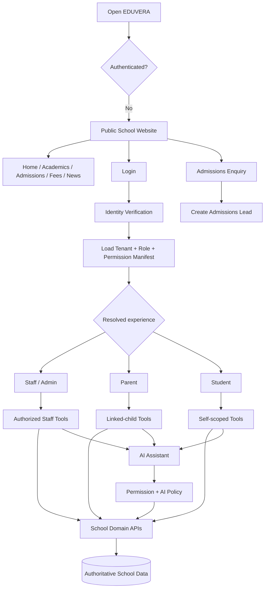

---

## 2. Permission-driven mobile navigation

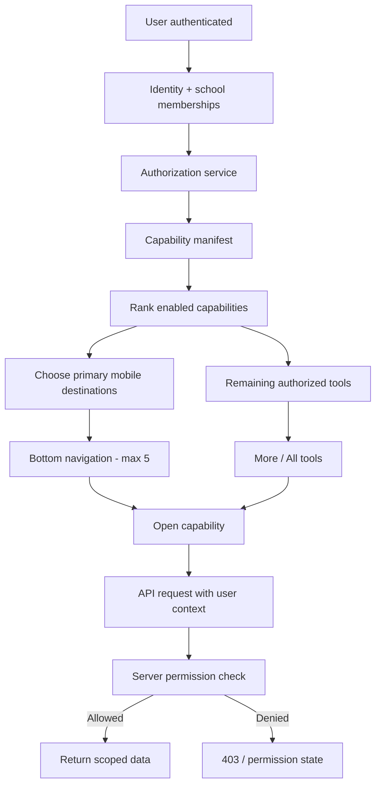

---

## 3. Recommended app navigation model

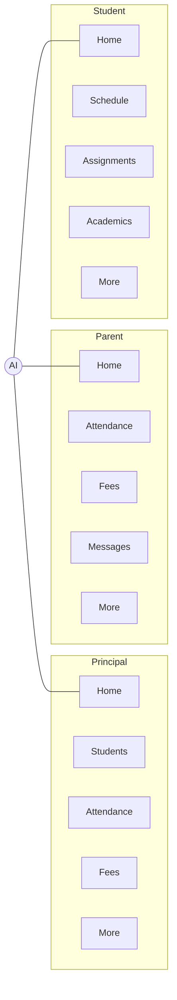

AI is globally reachable but does not bypass the user’s permission scope.

---

## 4. Admissions lifecycle

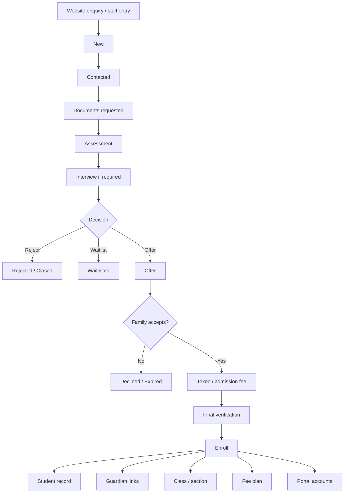

---

## 5. Fee lifecycle

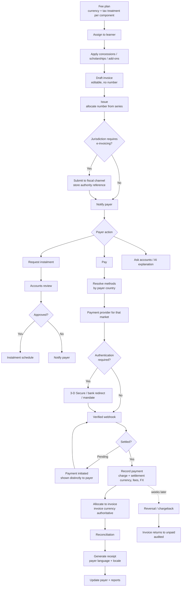

---

## 6. Attendance and leave flow

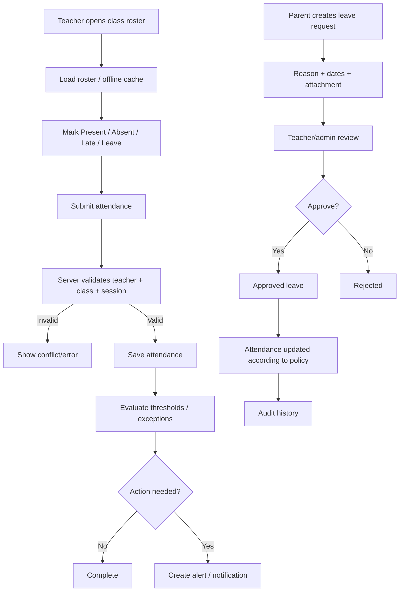

---

## 7. Timetable conflict/substitution flow

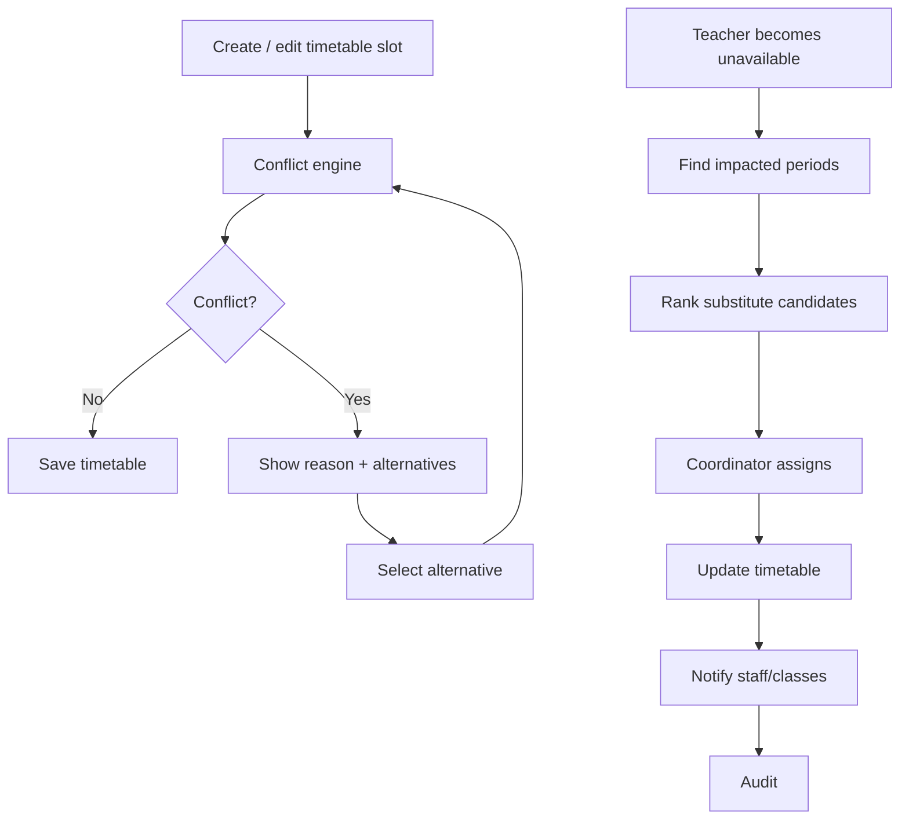

---

## 8. Messaging flow

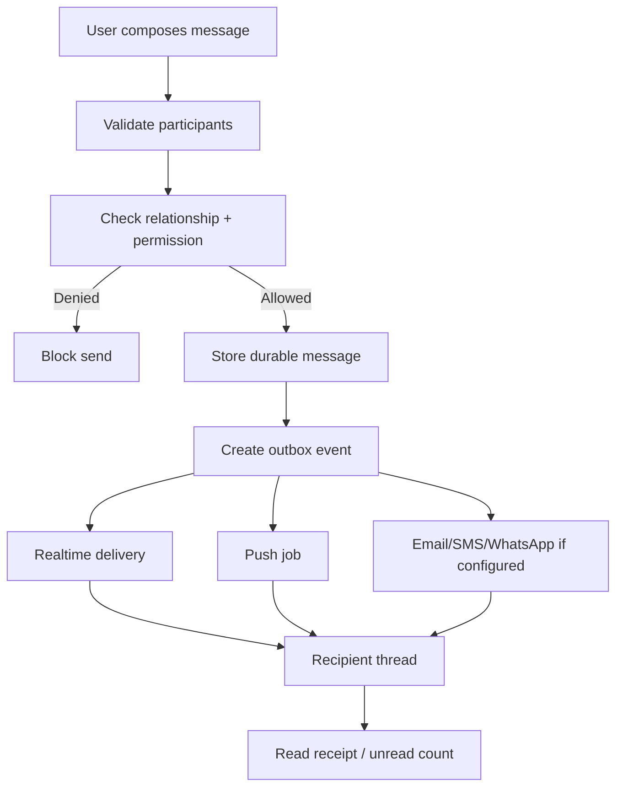

---

## 9. AI read flow

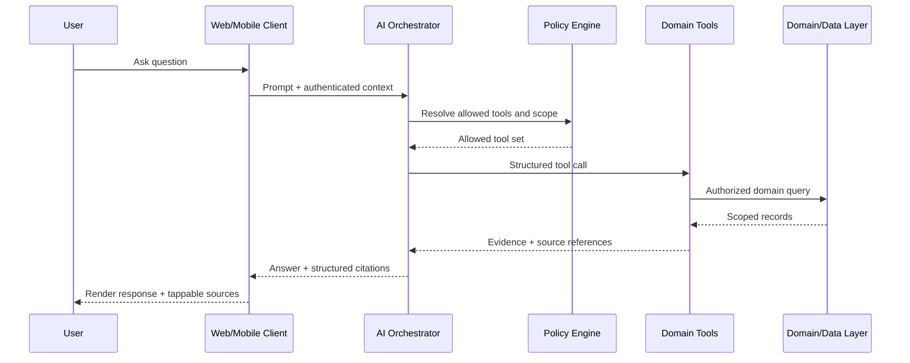

---

## 10. AI action confirmation flow

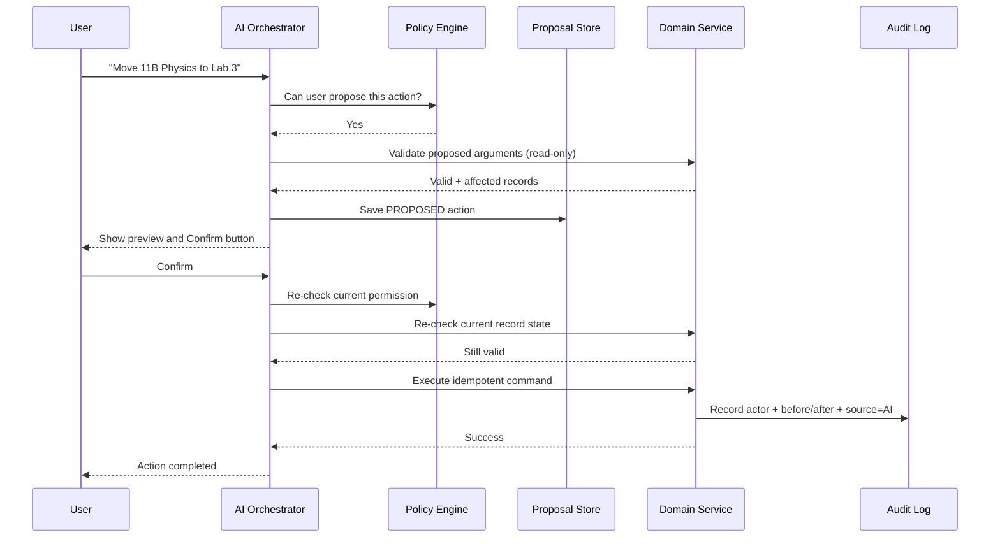

---

## 11. Parent fee payment flow

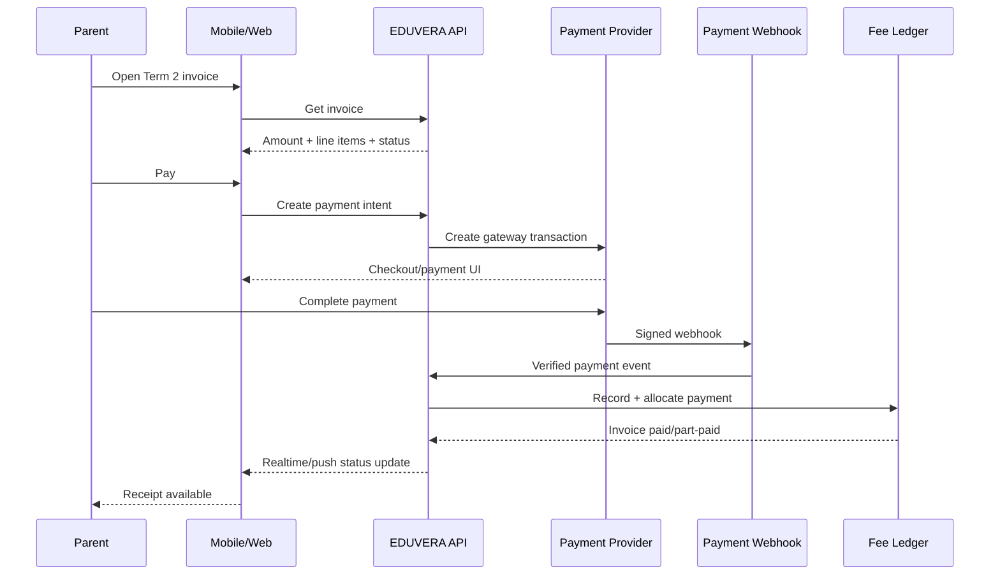

---

## 12. Parent child-scope flow

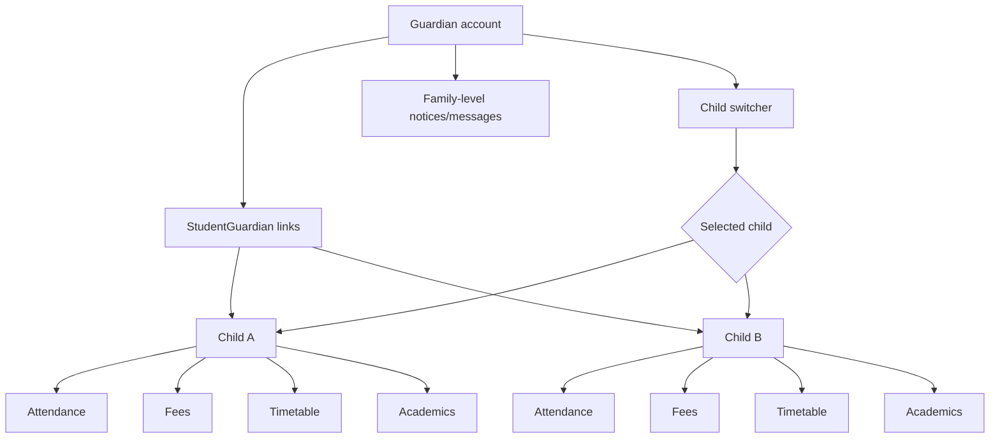

---

## 13. Student assignment flow

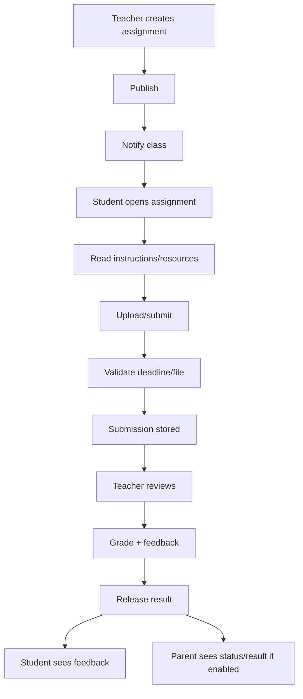

---

## 14. Technical data/event flow

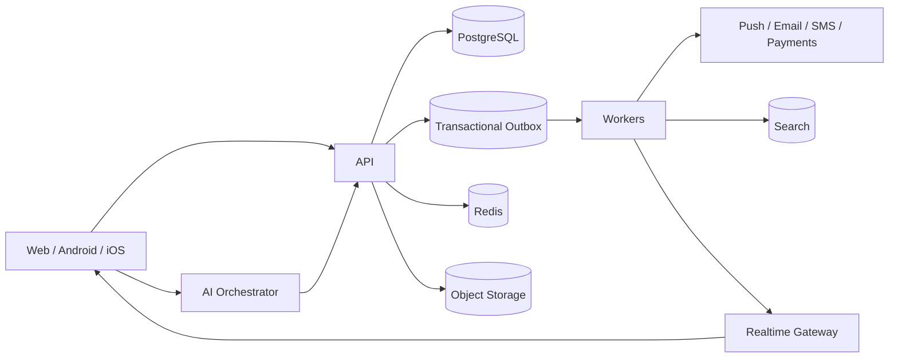

---

## 15. Release evolution

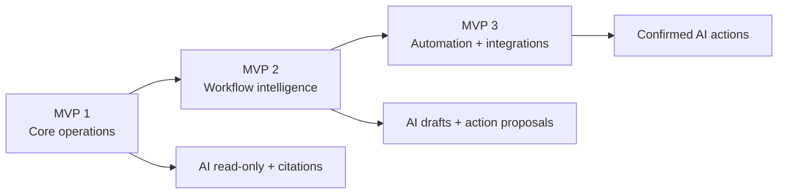

---

## 16. Architectural rule represented visually

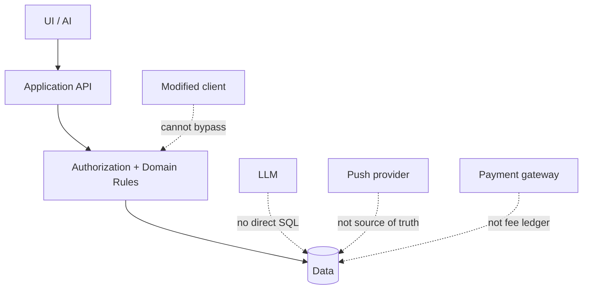

---

## 17. Product lifecycle summary

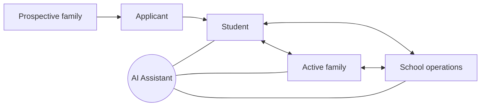

The same underlying school records power every authorized experience.

---

## 18. Cell-based scale-out topology

At 10,000 tenants the tenant population is split across cells. Each cell is a complete vertical slice; a thin global control plane routes to it and holds no school data.

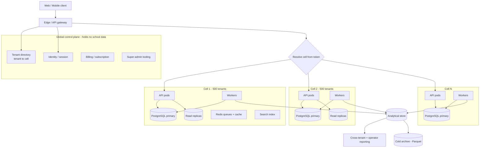

A cell never queries another cell's database. Anything spanning tenants is answered by the analytical store.

---

## 19. Attendance burst write path

The morning register is the highest-pressure write path in the product. Everything not required for the teacher's confirmation happens after commit.

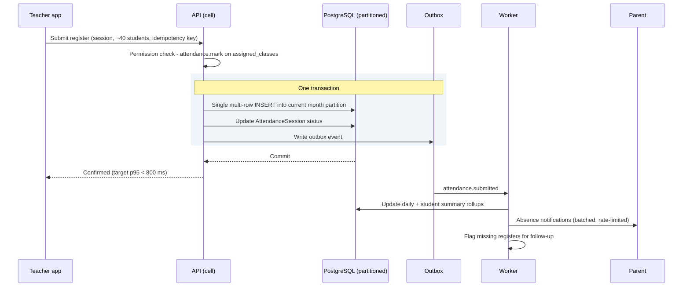

Dashboards and AI answers read the rollup tables, never the raw partitions.

---

## 20. Scale staging

Tenant count, not feature count, forces each transition.

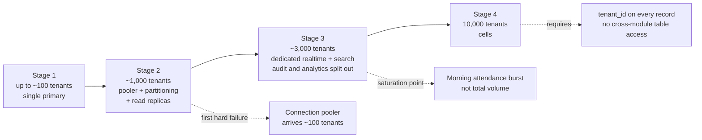

Extracting services does not relieve core data pressure. Only splitting the data tier does.

---

## 21. Institution profile resolution

One domain model serves schools, playschools, coaching centres and colleges. Institution type resolves a capability profile and a vocabulary pack; it never forks the schema.

```mermaid
flowchart TD
    TENANT[Tenant] --> TYPE[institution_type]
    TENANT --> JUR[country + jurisdiction]
    TENANT --> CUR[base currency]
    TENANT --> CAL[calendar + timezone]
    TENANT --> LOC[locale + terminology pack]

    TYPE --> PROFILE[Capability profile]
    JUR --> TAX[Tax profile + invoice series]
    JUR --> PRIV[Privacy + age of majority rules]
    JUR --> PAYCFG[Payment providers + methods]

    PROFILE --> NAV[Navigation + enabled modules]
    PROFILE --> ASSESS{Assessment shape}
    ASSESS --> MARKS[Marks + report card<br/>school]
    ASSESS --> OBS[Narrative observations<br/>playschool]
    ASSESS --> SCORE[Test scores<br/>coaching]
    ASSESS --> CREDIT[Credits + GPA + transcript<br/>college]

    PROFILE --> GROUPING{Class grouping}
    GROUPING --> GRADE[Grade + section]
    GROUPING --> BATCH[Rolling batch]
    GROUPING --> COURSE[Programme + course]

    PRIV --> GUARD{Learner is a minor?}
    GUARD -- Yes --> GLINK[Guardian holds access + consent]
    GUARD -- No --> SELF[Learner holds access<br/>guardian access only if granted]

    TAX --> BILLING[Billing behaviour]
    CUR --> BILLING
    PAYCFG --> BILLING
    LOC --> RENDER[Rendered terminology + formats]
```

The same records, the same permissions engine. Only the profile differs.

---

## 22. Invoice document lifecycle

An issued invoice is a legal document. It is never edited.

```mermaid
stateDiagram-v2
    [*] --> Draft
    Draft --> Draft: edit freely
    Draft --> Issued: allocate number from series

    Issued --> PartlyPaid: payment allocated
    Issued --> Overdue: due date passes
    PartlyPaid --> Paid: balance cleared
    Overdue --> PartlyPaid: payment allocated
    Overdue --> Paid: balance cleared

    Paid --> Reversed: direct debit reversal / chargeback
    Reversed --> Overdue: balance restored

    Issued --> Cancelled: cancelled, number retained
    Issued --> Credited: credit note issued
    PartlyPaid --> Credited: credit note issued
    Paid --> Credited: credit note issued

    Credited --> Refunded: surplus returned to payer
    Refunded --> [*]
    Paid --> [*]
    Cancelled --> [*]

    note right of Issued
        Immutable from here.
        Corrections are credit notes,
        never edits.
    end note
```

Cancelled and credited documents are retained permanently. Financial retention is set by jurisdiction and overrides the general archival policy.

---

## 23. AI feature compliance gate

Education AI is classified as high-risk in the EU where it touches admission, assessment, educational level or exam monitoring. Some capabilities are prohibited outright. Run every AI feature through this gate at design time, not at review time.

```mermaid
flowchart TD
    FEAT[Proposed AI feature] --> BAN{Infers emotion in a classroom,<br/>scores people socially,<br/>or scrapes faces?}
    BAN -- Yes --> STOP[Do not build<br/>prohibited practice]
    BAN -- No --> HR{Used for admission, assessment,<br/>educational level, or exam monitoring?}

    HR -- No --> STD[Standard obligations<br/>transparency, citations,<br/>permission scope, logging]
    HR -- Yes --> HIGH[High-risk obligations]

    HIGH --> RM[Risk management + data governance]
    HIGH --> DOC[Technical documentation]
    HIGH --> LOG[Automatic event logging retained]
    HIGH --> OVER[Human oversight by design]
    HIGH --> ACC[Accuracy + robustness targets]
    HIGH --> CONF[Conformity assessment + registration]
    HIGH --> POST[Post-market monitoring]

    STD --> AUTO
    HIGH --> AUTO{Decision has legal or<br/>similarly significant effect?}
    AUTO -- Yes --> HUMAN[No solely automated execution<br/>human confirms and is accountable]
    HUMAN --> CONTEST[Explanation, human review<br/>and contest workflow]
    AUTO -- No --> SHIP

    CONTEST --> SHIP[Ship, per-tenant and<br/>per-region toggleable]
    STD --> SHIP
```

A feature that cannot be offered compliantly in a market is switched off there cleanly. It is never silently degraded.

---

## 24. Data subject request flow

Institutions are the controllers and must be able to discharge their obligations inside the product.

```mermaid
flowchart TD
    REQ[Request received<br/>learner, guardian or adult learner] --> ID[Verify identity]
    ID --> WHO{Who holds the rights?}

    WHO -- Minor --> GUARD[Guardian exercises them]
    WHO -- Adult learner --> SELF[Learner exercises them]

    GUARD --> SCOPE
    SELF --> SCOPE[Determine scope across modules]

    SCOPE --> CLOCK[Start statutory clock<br/>deadline varies by jurisdiction]
    CLOCK --> TYPE{Request type}

    TYPE --> ACCESS[Access / export]
    TYPE --> CORRECT[Correction]
    TYPE --> ERASE[Erasure]
    TYPE --> OBJECT[Objection / restriction]

    ERASE --> RETAIN{Statutory retention<br/>applies to any of it?}
    RETAIN -- Yes --> PARTIAL[Erase by purpose<br/>retain financial and statutory records<br/>explain what is kept and why]
    RETAIN -- No --> FULL[Erase]

    ACCESS --> RESTRICTED{Restricted records<br/>in scope?}
    RESTRICTED -- Yes --> LEAD[Designated lead reviews<br/>before release]
    RESTRICTED -- No --> COMPILE
    LEAD --> COMPILE[Compile response]

    CORRECT --> COMPILE
    OBJECT --> COMPILE
    PARTIAL --> COMPILE
    FULL --> COMPILE

    COMPILE --> RELEASE[Review and release]
    RELEASE --> CLOSE[Close, whole chain audited]
```

Deletion is per purpose, never per person. Safeguarding and financial records commonly survive an erasure request that clears everything else.
